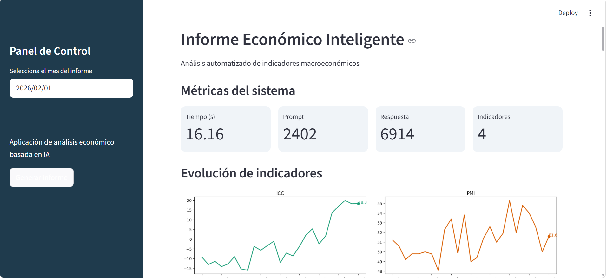
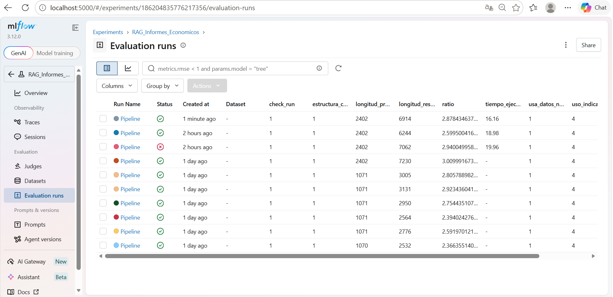

# 📊 Sistema Inteligente de Análisis con IA


## Demo del sistema

### Aplicación Streamlit



### Monitoreo con MLflow




## 📌 Descripción

Este proyecto implementa un sistema basado en inteligencia artificial para generar informes automatizados a partir de indicadores empresariales.

El sistema integra técnicas de RAG (Retrieval-Augmented Generation), modelos de lenguaje (LLM), visualización de datos y monitoreo de experimentos para replicar el análisis realizado por analistas.

---

## 🎯 Problema

El análisis tradicional depende de expertos que interpretan múltiples indicadores como:

- Índice de Confianza del Consumidor (ICC)
- Índice de Gestión de Compras (PMI)
- Índice de Incertidumbre Económica (IPEC)
- Indicador de Seguimiento a la Economía (ISE)

Este proceso es:

- Manual
- Subjetivo
- Difícil de escalar

---

## ✅ Solución propuesta

Se desarrolló un sistema inteligente que:

- Automatiza la generación de informes empresariales
- Integra múltiples indicadores en un análisis coherente
- Reduce la dependencia de interpretaciones manuales

---

## 🏗️ Arquitectura

El sistema sigue un pipeline:

1. Ingesta de datos desde Excel  
2. Procesamiento y estructuración  
3. Generación de informe con LLM (Gemini)  
4. Evaluación y monitoreo con MLflow  
5. Visualización en Streamlit  

---

## 📊 Data Strategy

### Misión
Automatizar el análisis empresarial mediante inteligencia artificial.

### Visión
Desarrollar un sistema escalable que apoye la toma de decisiones empresariales.

### KPIs

- Coherencia del informe generado
- Uso de indicadores en el análisis
- Tiempo de generación
- Calidad interpretativa del texto

---

## ⚙️ Metodología aplicada

### DataOps
- Limpieza y estructuración de datos
- Centralización en formato tabular

### MLOps
- Monitoreo con MLflow
- Registro de métricas y experimentos

### LLMOps
- Diseño iterativo de prompts
- Evaluación de outputs
- Control de alucinaciones

---

## 📈 Funcionalidades

- Selección de periodo
- Visualización de indicadores macroeconómicos
- Generación automática de informes
- Evaluación del modelo en tiempo real

---

## 📊 Resultados

El sistema logra:

- Generar informes económicos interpretativos automáticamente
- Integrar múltiples indicadores en un análisis coherente
- Reducir tiempo de análisis manual
- Permitir monitoreo de calidad mediante MLflow

Se evidencia que el uso de modelos de lenguaje permite replicar análisis de expertos bajo estructuras controladas.

---

## 🧪 Tecnologías

- Python
- Streamlit
- MLflow
- Google Gemini API
- Pandas
- Matplotlib

---

## 🚀 Cómo ejecutar el proyecto

A continuación se describen los pasos necesarios para reproducir completamente la solución y validar los resultados:

### 1. Instalar dependencias

Se recomienda crear y activar un entorno virtual previamente.

```bash
pip install -r requisitos.txt 
```

### 2. Configurar API Key de Gemini

Este proyecto utiliza el modelo Gemini-2.5-Flash a través de API. Debes configurar tu API Key como variable de entorno.

```bash
GOOGLE_API_KEY "TU_API_KEY"
```

### 3. Ejecutar la aplicación (Streamlit)

Para iniciar la interfaz del sistema:

```bash
python -m streamlit run app/streamlit_app.py
```

Desde esta aplicación podrás seleccionar el período de análisis, visualizar indicadores económicos y generar informes automáticamente.

### 4. Ejecutar el monitoreo con MLflow

Para visualizar la trazabilidad y métricas del sistema:

```bash
mlflow ui --backend-store-uri ./mlruns
```
Luego abre en tu navegador:

```bash
http://localhost:5000
```
Desde aquí podrás consultar ejecuciones anteriores, comparar resultados, analizar métricas del modelo y validar la calidad de los informes generados.

### 5. Reproducibilidad y adaptabilidad
Este sistema está diseñado para ser completamente reproducible. Puedes modificar los datos de entrada, ajustar las instrucciones del prompt y cambiar los indicadores o variables de análisis. Esto permite que cualquier empresa adapte la solución a sus necesidades específicas y genere informes personalizados en segundos.

---

## 📝 Nota de los autores: 
Te invitamos a consultar el documento docs\Paper_Herrera_Candelo.pdf si deseas profundizar en el contexto, la metodología y los resultados de este proyecto.